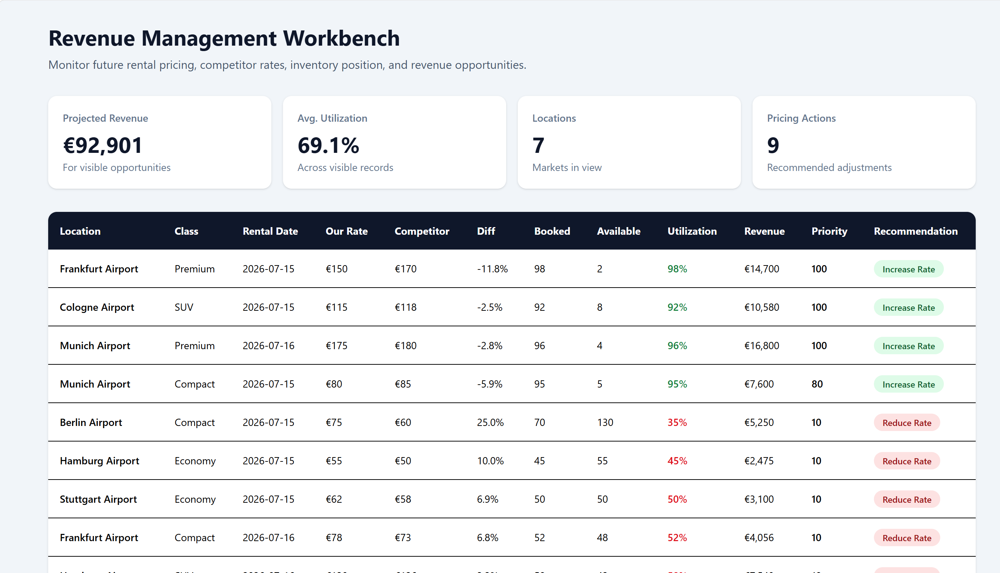
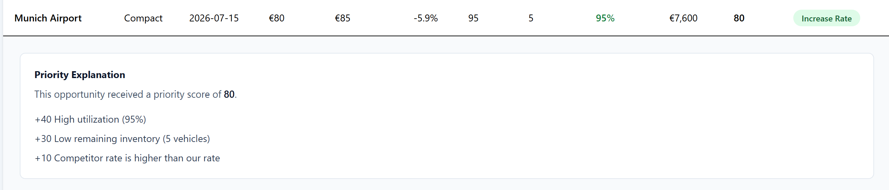
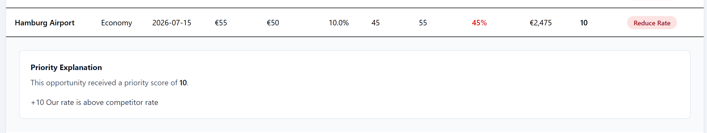
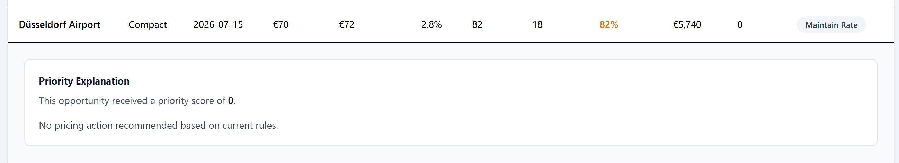

# Revenue Management Workbench

A prototype decision-support application for rental vehicle pricing and revenue management teams.

This prototype demonstrates how pricing analysts could evaluate fleet utilization, competitor pricing, demand signals, and revenue opportunities in a single workspace.

## Prototype Project Scope

This GIT repository contains a proof-of-concept prototype based on a broader Revenue Management Workbench solution design. The prototype focuses on demonstrating core workflows including KPI monitoring, pricing recommendations, competitor analysis, opportunity prioritization, and decision explainability.

Several capabilities described in the full solution design were intentionally not implemented, including advanced forecasting, real-time integrations, machine learning models, workflow automation, and production-grade data pipelines.

## Key Features

- KPI dashboard
- Pricing recommendations
- Competitor comparison
- Opportunity ranking
- Explainability panel
- Priority scoring

## Screenshots

### Dashboard

### Pricing Adjustment Recommendations

#### Increase Rental Rate:

#### Decrease Rental Rate:

#### Maintain Rental Rate:

## Technology

- React
- TypeScript
- Vite
- Tailwind CSS
- AI-assisted development

## Project Context

This project was created as part of an exploration of AI-assisted product prototyping and rapid concept validation.